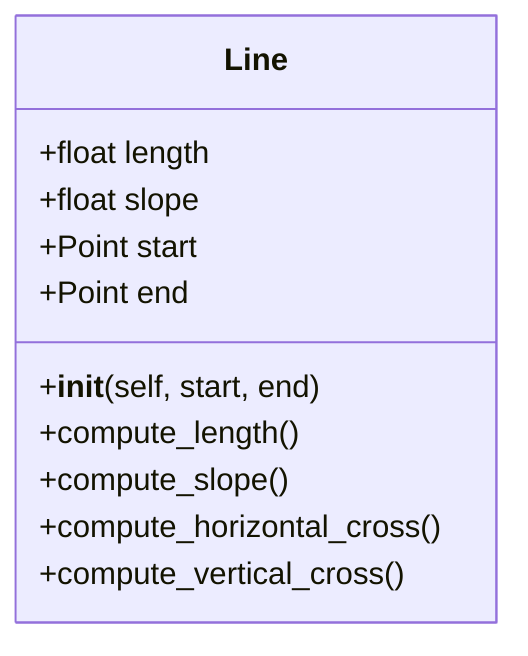

# Big_Class
Repsitory of the challenge #3
## Point 1
* Class Line
  we had to create a Class, that had the next atributes and methods:

  And then use it to create an other method in the class rectangle, where you can enter de rectangle as lines.
```python
  class Point:
   definition: str = "Abstract unit that represents a location in space"
   def __init__(self, given_x: float = 0, given_y: float = 0): # Initializer, simmilar to constructors
      # print("Initializer")
      self.x: float = given_x
      self.y: float = given_y
   def move(self, new_x, new_y):
      self.x = new_x
      self.y = new_y
   def reset(self):
      self.x = 0
      self.y = 0
```
  This Class point is important because with it we can enter a point like a coordenate.
```python
class Line:
    def __init__(self, lenght:float, slope:float, start:Point, end:Point ):
       self.lenght= lenght 
       self.slope = slope
       self.start = start # As the left point of the line
       self.end = end
    
    def Compute_Lenght(self,start:Point, end:Point)->float:
       lenght= (((((end.x)- (start.x))**2))+(((end.y)-(start.y))**2))**0.5
       return lenght 
    
    def Compute_slope(self,start:Point, end:Point) -> float:
       slope= ((end.y) - (start.y))/((end.x)-(start.x))
       return slope
    
    def Compute_Horizontal_Cross(self,start:Point, end:Point )-> bool: 
       if ((start.y)>= 0 and (end.y)<=0) or ((start.y<=0) and (end.y>=0)):
          return True 
       else:
          return False
        
    def Compute_Vertical_Cross(self,start:Point, end:Point) -> bool:
       if ((start.x)<= 0 and (end.y)>=0):
          return True 
       else:
          return False 
```
So, I created the class Line with the atributes asked and I created the methods:
* Compute lenght, with thw next formula: $\sqrt{(x2-x1)^2 + (y2-y1)^2 }$
* Compute slope, with the next formula $m= (y2-y1) / (x2-x1)$
* Compute horizontal cross, thinking that if the x component of the start is positive and the x component of the end is negativce or viceversa, the line has to cross the horizontal.
* Compute vertical cross, thinking that if the y component of the start is positive and the y component of the end is negativce or viceversa, the line has to cross the vertical.

```python
class Rectangle:
   
   def __init__(self, method: int, *args) -> None:
      if method == 1:
         # Bottom-left corner Point
         self.center: Point = Point(given_x=(((Line.Compute_Lenght(args[0], Point(given_x=args[0].x + args[1], given_y= args[0].y)))/2)+args[0].x), 
                                    given_y=(((Line.Compute_Lenght(args[0], Point(given_x=args[0].x, given_y= args[0].y+args[2])))/2)+args[0].y))
         self.width: float = args[1]
         self.height: float = args[2] 
      if method == 2:
         # Center point
         self.center: Point = args[0]
         self.width: float = args[1]
         self.height: float = args[2]
      if method == 3:
         #Opposite points
         self.center: Point = Point(given_x=(args[0].x + args[1].x)/2, given_y=(args[0].y + args[1].y)/2)

         if args[0].x < args[1].x:
               self.width: float = args[1].x - args[0].x #abs() ?
               self.height: float = args[1].y - args[0].y
         else:
               self.width: float = args[0].x - args[1].x
               self.height: float = args[0].y - args[1].y
      if method == 4:# Just this one can be use if the rectangle isn´t paralel to the plane 
         #Four Lines
         # (up_l_corner,up_r_corner,down_r_corner_3,down_l_corner )
         # The user is going to input the lines with the points of start and end
         self.center:Point = Point(given_x=(args[0].x + args[2].x)/2, given_y=(args[0].y + args[2].y)/2)
         self.width:float = Line.Compute_Lenght(args[0],args[1])
         self.height:float= Line.Compute_Lenght(args[1],args[2])
   
   
   def Compute_Area(self,width, height):
      print("The perimeter of the rectangle is " + str(width*height))

   def Compute_Perimeter(self,widht, height):
      print("The perimeter of the rectangle is " + str(2*widht + 2*height))

   def Compute_Interfencfe_point(self, point: Point) -> bool:
      if (self.point.x <= point.x <= self.point.x + self.width) and (self.point.y <= point.y <= self.point.y + self.height):
        return True
      else:
         return False  
```
For the 4 method   I decided that at the moment of inicializate the class, the arguments are going to be the four corners of the rectangle, because when we ask the user to enter the lines, they have to enter the start and end points of the lines, wich are the corners respectively. 
```python
print("Hello user!")
method: int = int(input("Enter the method you want to use to create the rectangle (1, 2, 3 or 4): "))
# ? Can you create an empty instance of an object?

if method == 1:
   x: float = float(input("Enter the x coordinate of the bottom-left corner: "))
   y: float = float(input("Enter the y coordinate of the bottom-left corner: "))
   width: float = float(input("Enter the width of the rectangle: "))
   height: float = float(input("Enter the height of the rectangle: "))
   rectangle = Rectangle(1, Point(x, y),width, height)

elif method == 2:
   x = float(input("Enter the x coordinate of the center: "))
   y = float(input("Enter the y coordinate of the center: "))
   width = float(input("Enter the width of the rectangle: "))
   height = float(input("Enter the height of the rectangle: "))
   rectangle = Rectangle(2, Point(x, y), width, height)

elif method == 3:
   x1: float = float(input("Enter the x coordinate of the first point: "))
   y1: float = float(input("Enter the y coordinate of the first point: "))
   x2: float = float(input("Enter the x coordinate of the second point (opposite to the first one): "))
   y2: float = float(input("Enter the y coordinate of the second point: "))
   rectangle = Rectangle(3, Point(x1, y1), Point(x2, y2))
elif method ==4:
   Points=[]
   print("Note: The first point of start has to be the upper left corner of the rectangle and the second one has to be the upper right corner, and the you keep going wirh the hands of the cloock")
   for i in range(4):
      line= Line(lenght=input(f"Enter the lenght of the line {i+1}: "),slope=input(f"Enter the slope of the {i+1} line: "), 
                 start=Point(given_x=input(f"Enter the x component of the {i+1} point of start: "), 
                             given_y=input(f"Enter the y component of the {i+1} point of start: ")),
                 end = Point(given_x=input(f"Enter the x component of the {i+1} point of end: "), 
                             given_y=input(f"Enter the y component of the {i+1} point of end: ") ))
      Points.append(line.start)
   rectangle = Rectangle(Points[0],Points[1],Points[2],Points[3])
else:
   print("Invalid method")


```
At the time I ask the user to enter the atreibutres of the lines, I have the 4 corners, so I put them in a list, and then index that list to put the arguments in the class rectangle.
lenght
